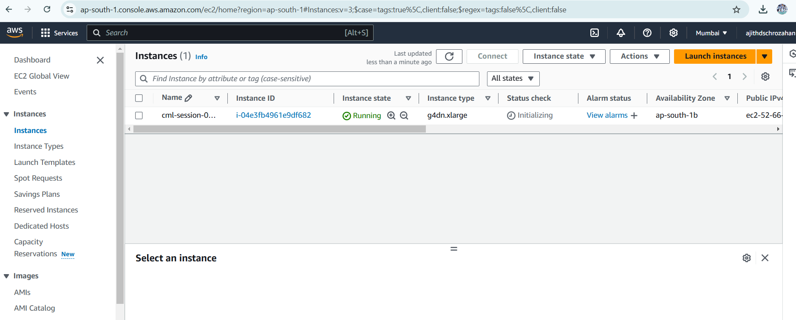
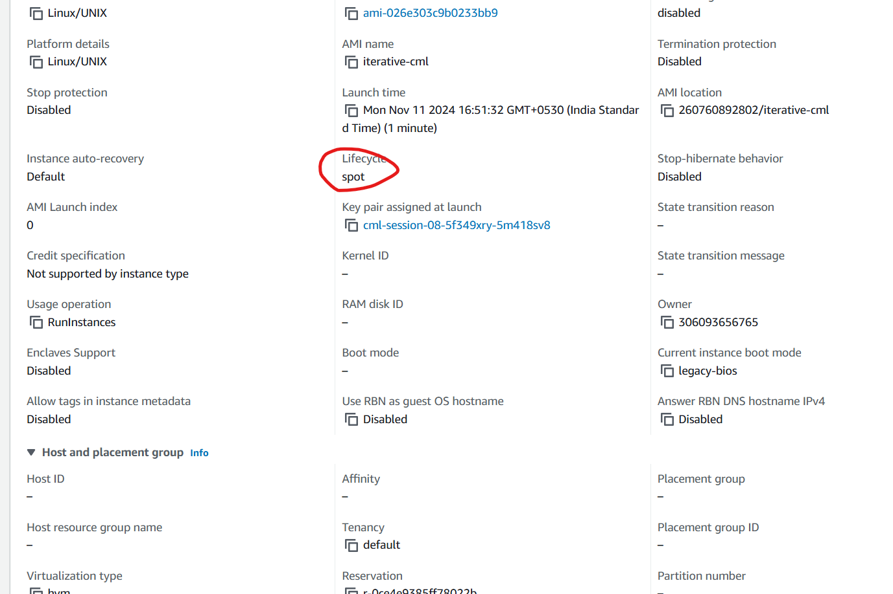
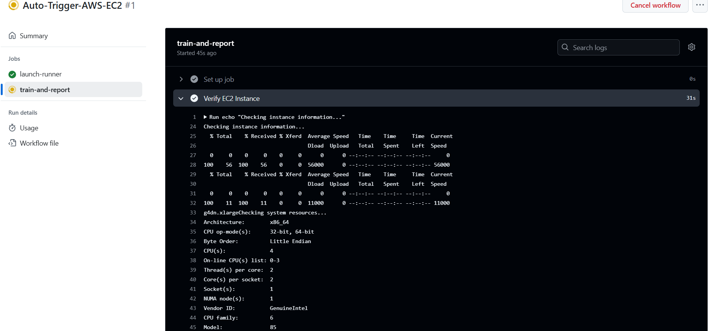
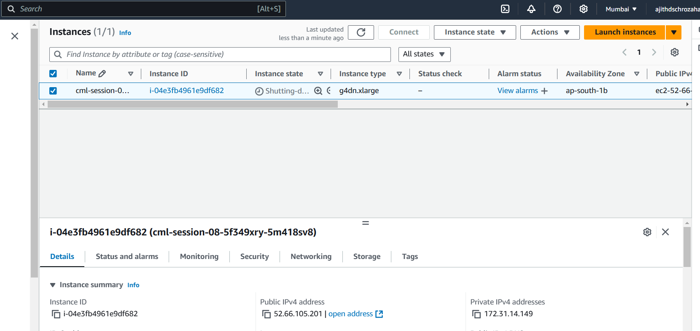
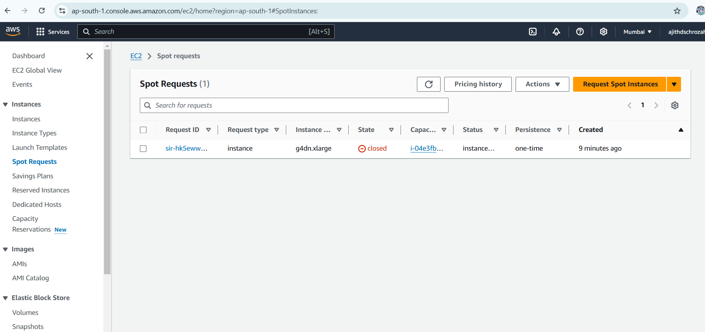

### Auto-Trigger-AWS-EC2-with-GPU

**Contents**

1. [Request AWS Spot Instance](#request-aws-spot-instance)
2. [Credentials Configuration](#credentials-configuration)
3. [Github Workflow](#github-workflow)
4. [Reference](#reference)


### Request AWS Spot Instance

*Note: This spot request is optional you can trigger cml launcher even without this spot instance type*

- Since spot instance is budget friendly i am explaining this blog with spot instance example

- Go to Searvice Quota -> AWS Services -> Amazon Elastic Compute Client(Amazon Ec2)
- Change the region to Mumbai ap-south-1 (nearest to your location)

    

- I need g4dn.xlarge so i am going to request "All G and VT Spot Instance Requests" in Quota name.

    

- After clicking "All G and VT Spot Instance Requests" name you need to click "Request increase at account level" and you can give 8 or 16 or 32 as input.
    

    Note: Spot instance takes 1 week for approval but the GPU cost would be 1/10 of the original gpu cost. Dont leave reading this blog because of that for running this experiment without spot instance takes less than 1 USD only.

### Credentials Configuration

Note: We can create roles or policies and proceed for specific permission I didnt explore it.

- Go to "I AM" dashboard and click the user that has account level permission

    

- Make sure it has "AdministratorAccess" perimission

    

- Click "Create Access Key" -> "Application running outside AWS" -> "Create access key" -> Download .csv file

    

- if you look at .csv file `Access key ID` and `Secret access key`

**Github Repo**

- Go to github repo where the workflow is going to run. Go to Settings -> "Secret and variables" -> Actions -> New repository secrets

- Give AWS_ACCESS_KEY_ID and its value like below and cliek `Add secret` from your .csv file

    

- Similarly store `AWS_SECRET_ACCESS_KEY` in `repository secrets`


- Store the fine_graded_personal-access_token generated got from your github account in the name `PERSONAL_ACCESS_TOKEN`. To run workflow you need additional privilage so better enable every checkbox when creating fine_graded_pak

    

### Github Workflow

There are many tools to start and stop AWS instances and services.

- We are going to use [cml-runner](https://github.com/iterative/setup-cml?tab=readme-ov-file#setup-cml-action) to trigger EC2 spot instance. Below is the trigger command.

```
cml runner launch --cloud=aws --name=session-08 \
    --cloud-region=ap-south-1 --cloud-type=g4dn.xlarge --cloud-hdd-size=64 \
    --cloud-spot --single --labels=cml-gpu --idle-timeout=100
```

`--idle-timeout=100` means after 100 seconds of idle time the instance shuts down

**Instance starts**





- With some verification methods `http://169.254.169.254/latest/meta-data/instance-type` we can confirm if we had triggered the similar instance and if GPU is also attached to it. You can see that its a g4dn.xlarge instance




- Since aws cli is not installed by default as we are not using specific CLI we can instance aws cli manually and configure. Refer workflow file for it


- After worflow execution by 100 seconds the EC2 instance shutdown and after complete shutdown within 5 minutes spot request also gets close. 

- Note: Ensure your spot request also closes properly else it may restart your instance again due to improper setting.

**EC2 shutdown**



**Spot request shutdown**



Job Run link - [here](https://github.com/ajithvcoder/autotrigger-aws-ec2-with-githubactions/actions/runs/11777520687/job/32802085220)

### Reference

1. [cml-example-cloud-gpu](https://github.com/iterative-test/cml-example-cloud-gpu)
2. [cml-runner](https://cml.dev/doc/ref/runner)
3. [cml-repo-setup](https://github.com/iterative/setup-cml?tab=readme-ov-file#setup-cml-action)
